## About me

{.absolute height=200 right=100 top=-100}

### Vestin Hategekimana

- **PhD student in demography**, [University of Geneva](https://www.unige.ch/sciences-societe/ideso/membres/vestin-hategekimana)

- **President**, [WeData](https://wedata.ch/)

- **Vice president, regional lead**, [Young AI Leaders Geneva](https://youngaileaders.ch/)

## Main takeaway

 

::: {.fragment}
> Don't **only** use the **default option**.
:::

::: {.fragment}
> Use what suits **you** the best.
:::
 

## A lot of choice

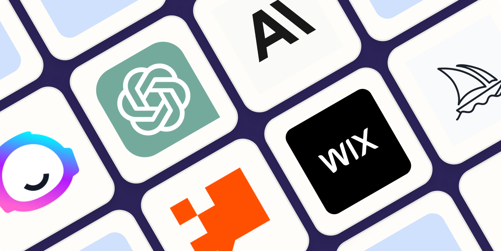

<small>[There is an AI for that](https://theresanaiforthat.com/)</small>

## A lot of combinations

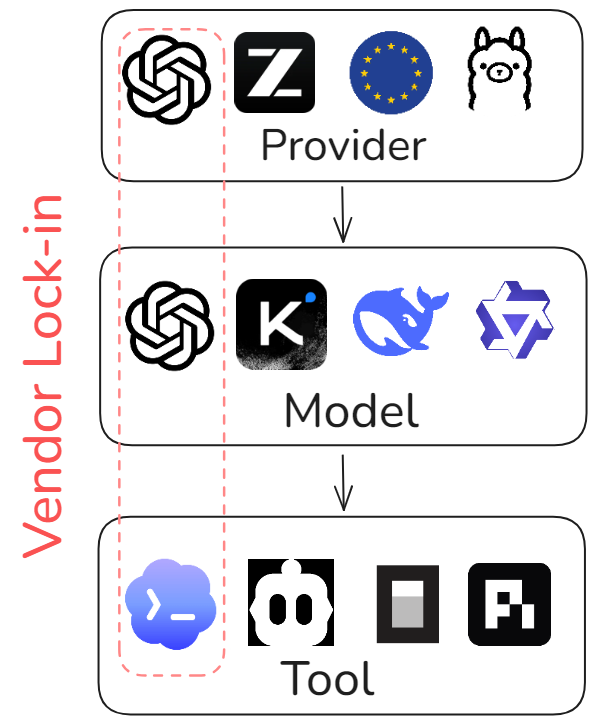

## Why should you care about your data in the AI era?

::: {.fragment}
- A huge part of your data is really sensitive
:::

::: {.fragment}
- It is more likely to be lost by accident now
<small>Privacy contract, shadow AI, sovereignty washing</small>
:::

::: {.fragment}
- Data is the new gold
 
<small>AI training</small>
:::

# The danger of the default option

## March 2023, Samsung, Hwaseong {background-color="#3C444D"}

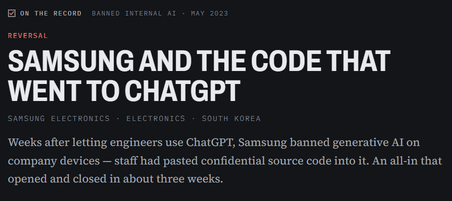

 

<small>[AI Incident Database, May 2, 2023](https://incidentdatabase.ai/cite/768)</small> |
<small>[Bankrupt by AI, March 30, 2023](https://www.bankruptbyai.com/case-files/samsung-code-leak)</small>

## They weren't careless {background-color="#3C444D"}

::: {.fragment}
Those engineers used the default.
:::

::: {.fragment}
> **The default was chosen for them.**
:::

<small>[You Pay $20/Month. ChatGPT Still Trains on You](https://lumichats.com/blog/chatgpt-claude-gemini-training-your-data-2026-privacy-guide)</small>

## October 2025: Stanford study {background-color="#3C444D"}

::: {.fragment}
> **6 of 6** major US chatbot companies train on your chats by default
:::

::: {.fragment}
> Some keep your data **indefinitely**.
:::

::: {.fragment}
> Privacy documentation is **often unclear**.
:::

 

<small>[Stanford HAI, October 2025. Amazon, Anthropic, Google, Meta, Microsoft, OpenAI: ~90% of the US chatbot market](https://news.stanford.edu/stories/2025/10/ai-chatbot-privacy-concerns-risks-research)</small>

## ChatGPT from 2023 to today {background-color="#3C444D"}

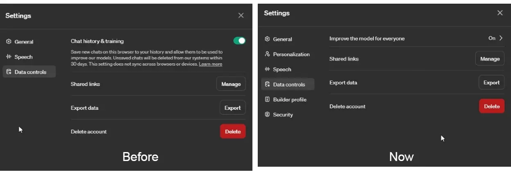

<small>[OpenAI Finally Relents; You Can Disable Model Training in ChatGPT While Retaining Chat History](https://beebom.com/chatgpt-disable-model-training-retain-chat-history/)</small>

## Two classes of user {background-color="#3C444D"}

**Data training**

:::: {.columns}

::: {.column width=50%}

**OFF** by default

- ChatGPT Business
- ChatGPT Enterprise
- ChatGPT Edu
- API Platform

:::

::: {.column width=50%}

**ON** by default

- ChatGPT Free
- ChatGPT Plus
- ChatGPT Pro

:::

::::

<small>[OpenAI Help Center, "What if I want to disable model training?"](https://help.openai.com/en/articles/8983130-what-if-i-want-to-keep-my-history-on-but-disable-model-training)</small>

## Early era {background-color="#3C444D"}

:::: {.columns}
::: {.column width="70%"}
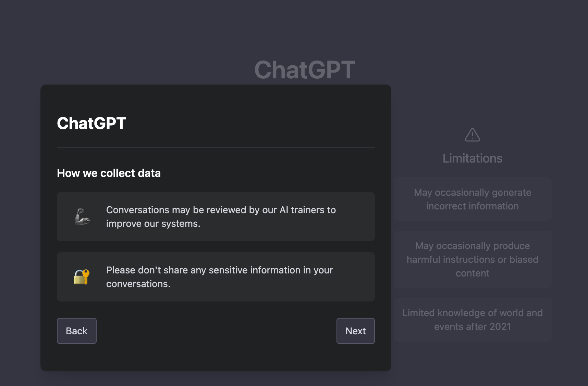
:::

::: {.column width="30%"}
::: {.fragment}
> Now everything is under multiple lines of **privacy documents**
:::

::: {.fragment}
> **Useful for quiet consent**
:::
:::
::::
<small>[https://www.chino.io/post/chatgpt-privacy-risks](https://www.chino.io/post/chatgpt-privacy-risks)</small>

## X and LinkedIn {background-color="#3C444D"}

:::: {.columns}
::: {.column width=30%}
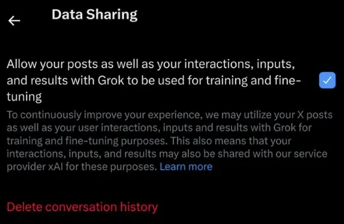
:::

::: {.column width=70%}
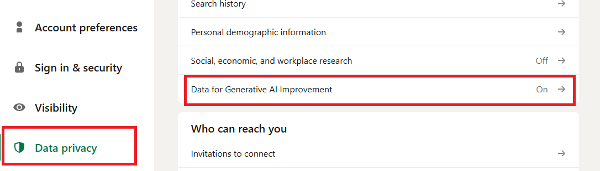
:::
::::
<small>[LinkedIn will use your data to train its AI unless you opt out now, September 2025](https://www.malwarebytes.com/blog/news/2025/09/linkedin-will-use-your-data-to-train-its-ai-unless-you-opt-out-now)</small> | <small>[X Adds New Setting To Opt out of Sharing Data To Train Grok](https://www.socialmediatoday.com/news/x-opt-out-of-sharing-your-data-to-train-grok/722601/)</small>

## So what?

The problem is not the data training...

::: {.fragment}
> But the **quiet consent**
:::

::: {.fragment}
> And the **retention practices**
:::

# Data sovereignty

## What is data sovereignty?

> It is the ability to control **where your data goes**, who sees it, and **which laws apply to it** when you use artificial intelligence.

 

::: {.fragment}
**Data sovereignty** ≠ **tech sovereignty**
:::

## Three axes

1. **(Distance) How far does your data physically travel?**
2. **(Retention) What happens to your prompt after the model reads it?**
3. **(Jurisdiction) What laws might require your data disclosed?**

## Axis 1: distance

**How far does your data physically travel?**

::: {.fragment}
1. **Foreign server**: owned by a company subject to laws you have never voted on
:::

::: {.fragment}
2. **EU server**: run by a company you chose
:::

::: {.fragment}
3. **Local**: you own
:::

## Axis 2: retention {auto-animate="true"}

**What happens to your prompt after the model reads it?**

::: {.fragment}
1. **Profiling**: your inputs build a longitudinal profile linked to your account
:::

## Axis 2: retention {auto-animate="true"}

What happens to your prompt after the model reads it?

1. **Profiling**: your inputs build a longitudinal profile linked to your account

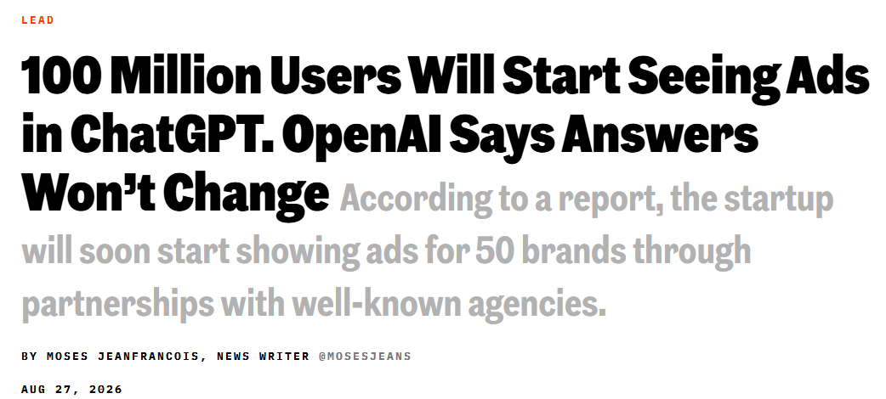

## Axis 2: retention {auto-animate="true"}

What happens to your prompt after the model reads it?

1. **Profiling**: your inputs build a longitudinal profile linked to your account

2. **Training**: no longer your data, it's someone else's weights

::: {.fragment}
3. **Stored but unused**: logged for abuse monitoring, may be requested by third parties
:::

::: {.fragment}
4. **Stored and encrypted**: only the user can read the data
:::

::: {.fragment}
5. **Zero data retention**: data is used only at inference and then deleted, history stays locally
:::

::: {.fragment}
6. **Local**: no data leaves your machine
:::

## Navier-Stokes priority case {background-color="#3C444D"}

::: {.fragment}
1. Two mathematicians, **Buckmaster** and **Alpöge**, spent a year on a
proof related to the Navier-Stokes Millennium Prize.
:::

::: {.fragment}
2. Working drafts went into **OpenAI's tool Codex**.
:::

::: {.fragment}
3. In *September 8th 2026*, OpenAI's agents produced a claim on the same problem,
**twelve hours after** one of the mathematicians posted his own result.
:::

::: {.fragment}
> OpenAI rejected direct access to the files, but admitted their AI had been trained on it
:::

<small>[Navier-Stokes priority controversy Wikipedia](https://en.wikipedia.org/wiki/Navier%E2%80%93Stokes_priority_controversy)</small>

## Axis 3: jurisdiction (1)

**What laws might require your data disclosed?**

::: {.fragment}
1. **Foreign rules**: US Cloud Act or China's Cybersecurity Law
:::

::: {.fragment}
2. **European rules**: GDPR one-stop-shop
:::

::: {.fragment}
3. **Local**: your or your institution's rules
:::

## Axis 3: jurisdiction (2)

**The CLOUD Act, 2018 (USA)**:

> an American provider must hand over data, **"regardless of whether such communication is located within or outside of the United States."**

::: fragment
What counts is **who controls the provider**, the server's location is legally irrelevant.
:::

<small>[The CLOUD Act: A Plain-English Guide to Your Data & Government Access](https://uslawexplained.com/cloud_act)</small>

## Axis 3: jurisdiction (3)

**The Cybersecurity Law, 2017 (China)**

> providers must cooperate with state security investigations, **provide technical support and decryption capabilities**, and store "important data" **on servers inside China**.

::: fragment
Here, the server location matters: it must be **physically in China** for most AI workloads.
:::

<small>[Cybersecurity Law of the People's Republic of China - wiki](https://en.wikipedia.org/wiki/Cybersecurity_Law_of_the_People%27s_Republic_of_China)</small>

## Axis 3: jurisdiction (4)

**General Data Protection Regulation (GDPR)**

> Requires data to **stay in the EEA** (or have specific transfer mechanisms) and **limits transfers** to countries without "adequate" protection.

::: fragment
A company can be **100% GDPR-compliant** (having a public DPA, zero retention policies, and EU staff) but **still be subject to the US CLOUD Act** if it has a US parent company
:::

## Three axes, one map {auto-animate="true"}

:::: {.columns}

::: {.column}
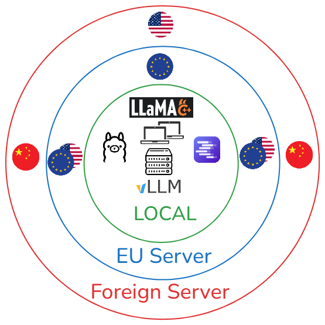
:::

::: {.column}
**All three axes overlap**
:::
::::

## Three axes, one map {auto-animate="true"}

:::: {.columns}

::: {.column}
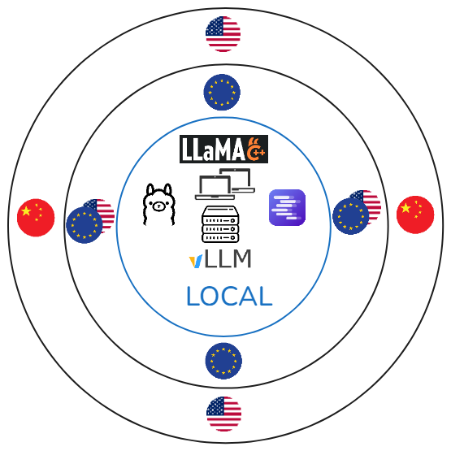
:::

::: {.column}
**Local**

- No **distance** concerns
- No **retention** concerns
- No **jurisdiction** concerns
:::
::::

## Three axes, one map {auto-animate="true"}

:::: {.columns}

::: {.column}

:::

::: {.column}
**Defense, state secrets, classified**

Sensitive data, things that should never leave your computer, ...
:::
::::

## Three axes, one map {auto-animate="true"}

:::: {.columns}

::: {.column}
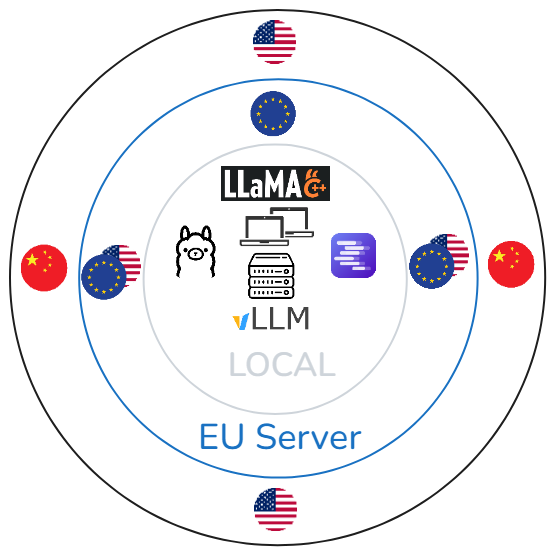
:::

::: {.column}
**EU server**

- **Small distance**
- **Retention is important now**
- **Might face the CLOUD Act**
:::
::::

## Three axes, one map {auto-animate="true"}

:::: {.columns}

::: {.column}

:::

::: {.column}
**Personal data (standard GDPR)**

Customer records, employee data, anything with names attached

**Regulated data**

Health data, banking secrecy, legal privilege, HR investigations
<small>Zero data retention</small>

**Intellectual property**

Source code, unreleased designs, the Samsung data <small>encryption/zero data retention</small>
:::
::::

## Three axes, one map {auto-animate="true"}

:::: {.columns}

::: {.column}
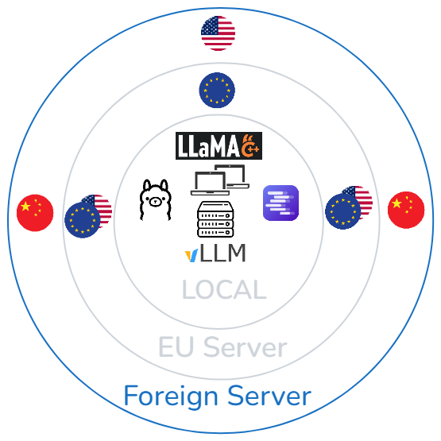
:::

::: {.column}
**Foreign server**

- **Long distance**
- **Retention matters**
- Either **CLOUD Act** or **Cybersecurity Law** apply
:::
::::

## Three axes, one map {auto-animate="true"}

:::: {.columns}

::: {.column}

:::

::: {.column}
**Already public data.**

Marketing copy drafts, published documentation, generic research, ...

**Internal, non-personal, non-secret**

Meeting notes that will be published anyway, non-critical internal comms.
:::
::::

# Local and open-weight model

## Definitions

**Open-weight model**

> Free model that you can download and use, and you can modify by fine-tuning. (Llama, Qwen, Kimi, GLM, ...)

::: {.fragment}
**Open-weight** ≠ **open-source** (+ data and documented steps)
:::

::: {.fragment}
**Closed model**

> Owned by a company, the model is non-transparent. (GPT, Claude, Grok, ...)
:::

## Why "local" is no longer a compromise

1. **Really good**
2. **Cheap**
3. **Accessible**

## The gap today (4 months)

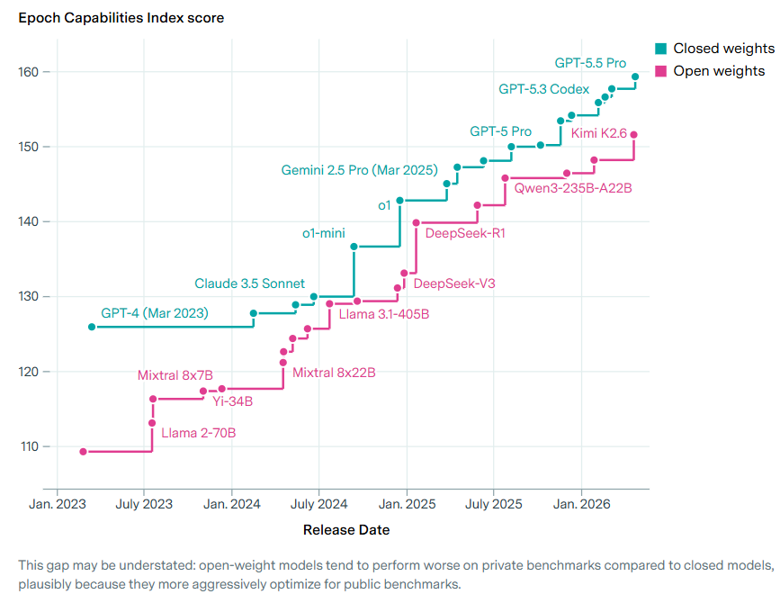

<small>[Epoch AI (May 2026)](https://epoch.ai/data-insights/open-closed-eci-gap)</small>

## What "four months behind" actually means

**Then:** "Like GPT-3 vs GPT-5" - different eras

**Now:** "Like GPT-5 vs GPT-5.5" - same era, minor version

<small>[Epoch AI (May 2026)](https://epoch.ai/data-insights/open-closed-eci-gap)</small>

## Cheap (1)

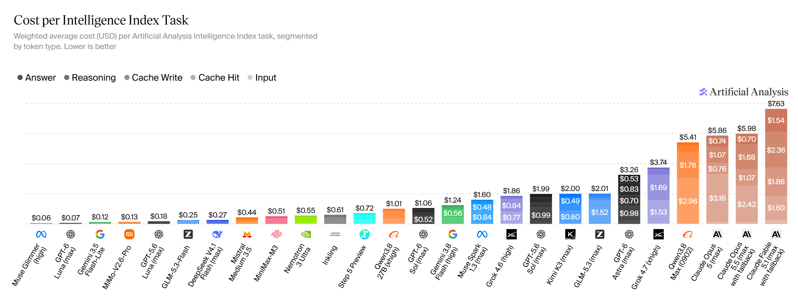

<small>[Independent analysis of AI - Artificial Analysis](https://artificialanalysis.ai/)</small>

## Cheap (2)

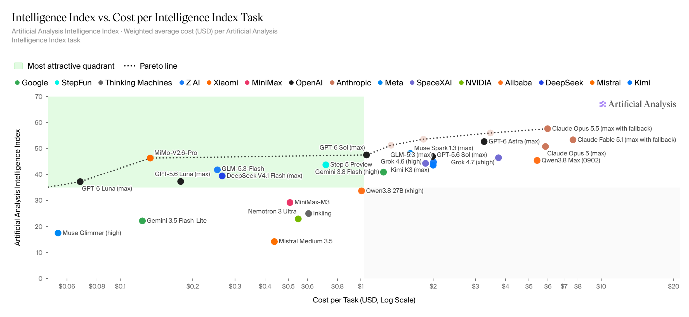

<small>[Independent analysis of AI - Artificial Analysis](https://artificialanalysis.ai/)</small>

## Scale milestones (mid-2026)

**Kimi K3** - *Largest open model ever*

**Qwen3.8-27B** - *Single consumer GPU*

**GLM5.3** - *Max: frontier performance, Flash: fast and really cheap*

## Limitations

**1. Cheapest per token ≠ cheapest per task**

**2. Benchmarks may flatter open models (benchmark gaming)**

**3. Agentic tool use remains a gap**

# Options

## AI services (snapshot)

::: {.fragment}
**1. Self-hosted**: absolute control, your hardware. Zero data leaves.
:::

::: {.fragment}
**2. Full-stack European clouds**: European owners, European stacks.
:::

::: {.fragment}
**3. GPU neoclouds**: European or hybrid compute, **bring your own models**. Jurisdiction varies.
:::

::: {.fragment}
**4. Routers and gateways**: one European legal wrapper, many models underneath.
:::

::: {.fragment}
**5. Wrapped hyperscalers**: a European mask over American machinery.
:::

## 1. Self-hosted {auto-animate="true"}

- Download the tool

- Download the model

- Run everything locally

<small>[Ollama](https://ollama.com)</small> |
<small>[LM Studio](https://lmstudio.ai/)</small> |
<small>[vLLM](https://docs.vllm.ai)</small> |
<small>[llama.cpp](https://github.com/ggml-org/llama.cpp)</small> |
<small>[SGLang](https://www.sglang.io/)</small>

## 1. Self-hosted {auto-animate="true"}

::: {.columns}

::: {.column}

**Pros:**

  - Absolute sovereignty
  - No vendor lock-in
  - Predictable costs

:::

::: {.column}

**Cons:**

  - Hardware barrier

:::

:::

<small>[Ollama](https://ollama.com)</small> |
<small>[LM Studio](https://lmstudio.ai/)</small> |
<small>[vLLM](https://docs.vllm.ai)</small> |
<small>[llama.cpp](https://github.com/ggml-org/llama.cpp)</small> |
<small>[SGLang](https://www.sglang.io/)</small>

## 1. Self-hosted {auto-animate="true"}

**Resources to get started on local models**

- [Local LLM Inference in 2026: The Complete Guide to Tools](blog.starmorph.com/blog/local-llm-inference-tools-guide)
- [A Beginner's Guide to Running AI Models Locally](itsthatlady.dev/blog/beginners-guide-to-local-ai)
- [Getting Started with Local AI: Run LLMs on Your Own Hardware](willitrunai.com/blog/getting-started-local-ai)
- [vLLM vs Ollama vs llama.cpp: Local Inference in 2026](https://whysogeek.com/vllm-ollama-llamacpp-which-inference-engine-2026/)
- [How to Run a Local AI Coding Agent](llmconfigurator.com/en/guides/coding-agents/setup-local-coding-agent)
- [Unsloth documentation](unsloth.ai/docs)

## 2. Full-stack European clouds {auto-animate="true"}

European-owned infrastructure offering native AI endpoints and some allow to bring your own model.

## 2. Full-stack European clouds {auto-animate="true"}

::: {.columns}

::: {.column}

**Pros:**

  - Jurisdictional safety
  - Tech stack transparency
  - Compliance

:::

::: {.column}

**Cons:**

  - Model variety
  - Pricing
  - Ecosystem

:::

:::

<small>[OVHcloud](https://www.ovhcloud.com/en/public-cloud/ai-endpoints)</small> |
<small>[Scaleway](https://www.scaleway.com/en/generative-apis)</small> |
<small>[STACKIT](https://stackit.com/en/products/data-ai/stackit-ai-model-serving)</small> |
<small>[T Cloud Public](https://www.t-cloud-public.com/en/solutions/use-cases/artificial-intelligence/ai-foundation-services)</small> |
<small>[OUTSCALE](https://en.outscale.com)</small> |
<small>[Cloud Temple](https://www.cloud-temple.com/en/products/large-language-model-as-a-service-llmaas)</small> |
<small>[NumSpot](https://numspot.com/en)</small> |
<small>[IONOS](https://cloud.ionos.com/managed/ai-model-hub)</small> |
<small>[Exoscale](https://www.exoscale.com/ai-cloud-infrastructure/managed-inference)</small> |
<small>[Infomaniak](https://www.infomaniak.com/en/hosting/ai-services)</small>

## 3. GPU neoclouds {auto-animate="true"}

Specialized compute providers focusing on raw GPU power, often allowing you to bring your own model (BYOM).

<small>[Verda](https://verda.com)</small> |
<small>[Nebius](https://tokenfactory.nebius.com)</small> |
<small>[Nscale](https://www.nscale.com)</small> |
<small>[CloudFerro](https://cloudferro.com)</small> |
<small>[Berget AI](https://berget.ai/en)</small> <small>(UK jurisdiction)</small>

## 3. GPU neoclouds {auto-animate="true"}

::: {.columns}

::: {.column}

**Pros:**

- Cost efficiency (cheaper)
- Flexibility (choice)
- Scalability

:::

::: {.column}

**Cons:**

- Jurisdiction risk (Cloud Act)
- Need management

:::
:::

<small>[Verda](https://verda.com)</small> |
<small>[Nebius](https://tokenfactory.nebius.com)</small> |
<small>[Nscale](https://www.nscale.com)</small> |
<small>[CloudFerro](https://cloudferro.com)</small> |
<small>[Berget AI](https://berget.ai/en)</small> <small>(UK jurisdiction)</small>

## 4. Routers and gateways {auto-animate="true"}

Services that sit between you and multiple backend providers, routing requests based on your rules.

<small>[cortecs](https://cortecs.ai)</small> |
<small>[TextCortex](https://textcortex.com/eu-ai-models/openrouter-alternative-europe)</small> |
<small>[Requesty](https://www.requesty.ai/eu)</small>

## 4. Routers and gateways {auto-animate="true"}

::: {.columns}

::: {.column}

**Pros:**

- Unified interface (single API)
- Optimization (dynamic router)

:::

::: {.column}

**Cons:**

- Sovereignty washing risk
- Trust dependency (check)

:::

:::

<small>[cortecs](https://cortecs.ai)</small> |
<small>[TextCortex](https://textcortex.com/eu-ai-models/openrouter-alternative-europe)</small> |
<small>[Requesty](https://www.requesty.ai/eu)</small>

## 5. Wrapped hyperscalers {auto-animate="true"}

<small>[S3NS](https://s3ns.io)</small> |
<small>[Bleu](https://www.bleucloud.fr)</small> |
<small>[AWS European Sovereign Cloud](https://www.aws.eu)</small> |
<small>[Azure EU Data Boundary](https://www.microsoft.com/en-us/trust-center/privacy/european-data-boundary-eudb)</small>

## 5. Wrapped hyperscalers {auto-animate="true"}

::: {.columns}

::: {.column}

**Pros:**

  - Performance (frontier)
  - Ecosystem (good integration)
  - Scale

:::

::: {.column}

**Cons:**

  - No control (US, China)
  - Dependency

:::
:::

<small>[S3NS](https://s3ns.io)</small> |
<small>[Bleu](https://www.bleucloud.fr)</small> |
<small>[AWS European Sovereign Cloud](https://www.aws.eu)</small> |
<small>[Azure EU Data Boundary](https://www.microsoft.com/en-us/trust-center/privacy/european-data-boundary-eudb)</small>

## Summary {.scrollable}

| Category | Options | Distance (data flow) | Retention (what they keep) | Jurisdiction (legal shield) |
| :--- | :--- | :--- | :--- | :--- | :--- |
| **1. Self-hosted** | Ollama, LM Studio, vLLM, llama.cpp, SGLang | **Local** (your machine) | **Zero** (unless you enable history/logs) | **Your jurisdiction** (physical control) |
| **2. Full-stack EU clouds** | OVHcloud, Scaleway, STACKIT, T Cloud Public, OUTSCALE, Cloud Temple, NumSpot, IONOS, Exoscale, Infomaniak | **EU** (data stays in EU data centers) | **Configurable** (most offer "zero retention" or strict "no training" options; check specific SLA) | **EU** (protected from CLOUD Act; governed by EU courts) |
| **3. GPU neoclouds** | Verda, Nebius, Nscale, CloudFerro, Berget AI | **EU/UK** (varies by region selection) | **Variable** (often zero retention for inference; check training policies) | **Mixed** (Nebius/Verda/CloudFerro: EU; **Berget AI: UK**) |
| **4. Routers & gateways** | cortecs, TextCortex, Requesty | **EU** (routing layer in EU) | **Configurable** (zero retention modes available) | **EU** (GDPR-native, but *depends on upstream provider*) |
| **5. Wrapped hyperscalers** | S3NS, Bleu, AWS EC, Azure EUD | **EU** (data physically in EU) | **Variable** (often retained for model improvement unless opted out) | **US/global** (parent company subject to CLOUD Act) |

## Main takeaway

 

::: {.fragment}
> Don't **only** use the **default option**.
:::

::: {.fragment}
> Use what suits **you** the best.
:::
 

# Thank you for your attention
